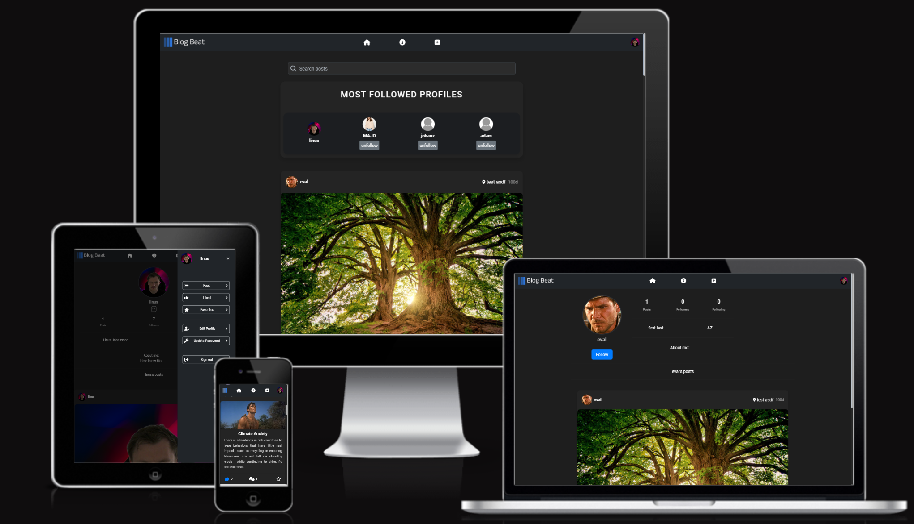
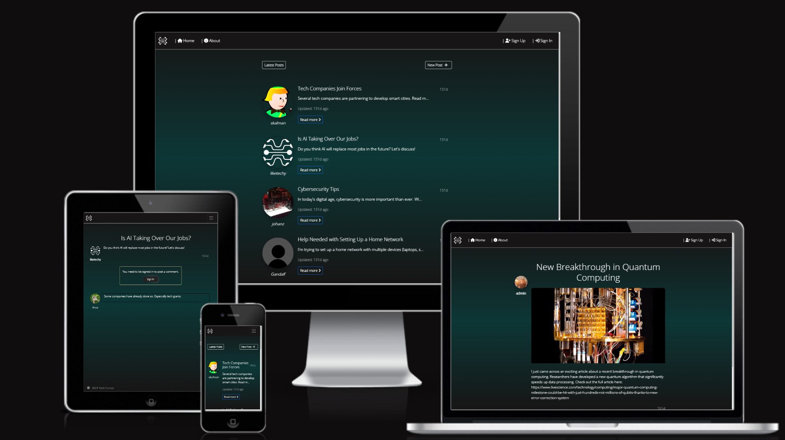
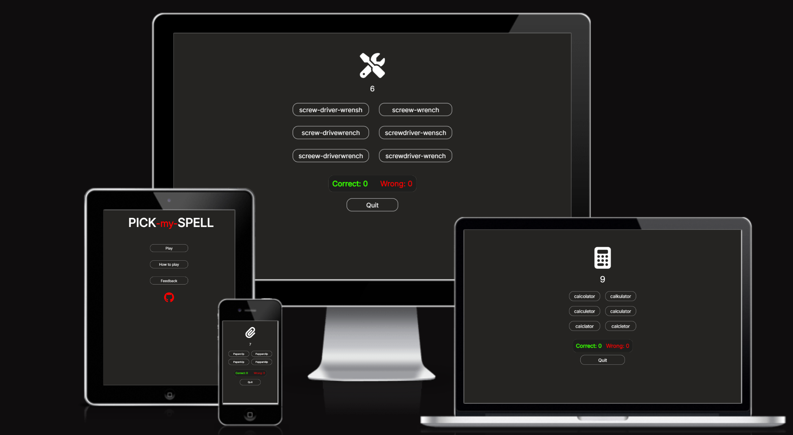
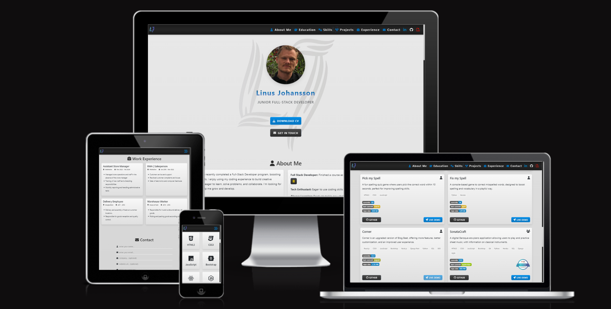

  

  
  

---

  
  
  
  
  
  
  
  
  
  
  
  

---

<h2 align="center"> Hi there!👋</h2>

I'm a <strong>Junior Full Stack Developer</strong> who recently completed a program at <em>Code Institute</em>. I'm passionate about building creative and efficient solutions using my coding experience. I love learning, problem-solving, and collaborating with others. Currently, I'm seeking new opportunities to grow and contribute to exciting projects.

---

  
  

---

<h2 align="center">🚀 Top Projects</h2>

  
<strong>Code Institute Projects</strong>

  

  

    

      
<strong>Blog Beat</strong>

       
        

          
        

         
        

          
          
          
          
        

        

          <strong>An interactive platform for reading, writing, and engaging with blog posts, designed for bloggers and readers.</strong>
        

        

          
          

            
            
          

        

    

    

      
<strong>Tech Corner</strong>

       
      

        
      

      <h5>A community blog and news site for tech enthusiasts to share and engage with the latest in technology.</h5>
      

        
      

      

        
         
        
        
        
      

    

    

      
<strong>Games</strong>

       
      

        
      

      <h5>A spelling quiz game where users pick the correct word within 10 seconds.</h5>
      

        
      

      

        
         
        
        
        
      

      

      

        
      

      <h5>A console-based game to correct misspelled words, designed to boost spelling in a playful way.</h5>
      

        
         
        
        
        
      

    

  

  

  
<strong>Portfolio</strong>

   
  

    
  

  <h5>My personal website is based on my CV and showcases my skills, experience, and projects.</h5>
  

    
  

  

    
     
    
    
    
  

