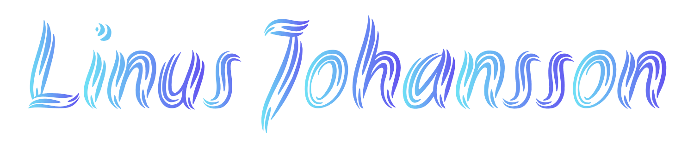

---

# Hi there! 👋

I'm a Junior Full Stack Developer who recently completed a Full-Stack Developer program at [Code Institute](https://codeinstitute.net/se/).
I enjoy using my coding experience to build creative solutions, and I'm always eager to learn, solve problems, and collaborate. I'm looking for opportunities that will help me grow and develop.

---

## 🛠️ Skills

## 🌱 Currently learning

---

---

## 🚀 Projects

Hackathon Sep 2024

  

*This project was part of the September-24 Hackathon, hosted by [Code Institute](https://hackathon.codeinstitute.net/hackathon/50/).*

*For detailed progress and task management, visit our [Project Board](https://github.com/users/Damitwhy/projects/6).*

| Contributor                              | Role                |
|------------------------------------------|---------------------|
| [j0hanz](https://github.com/j0hanz)       | Full-stack Developer        |
| [Damitwhy](https://github.com/Damitwhy)   | SCRUM master   |
| [DavidFB94](https://github.com/DavidFB94) | Full-stack Developer  |
| [NontyD](https://github.com/NontyD)       | Front-end Developer         |
| [jhoanTrujillo](https://github.com/jhoanTrujillo) | Full-stack Developer     |

 

My Portfolio Website

  

*My portfolio site built with React and Bootstrap, featuring custom gradient styling.*

 

Blog Beat

   

*Frontend built with React, Bootstrap, and Axios for API services.*

 

*Backend built using Django REST Framework.*

 

Tech Corner

   

*A community blog and news site built with Django and Bootstrap.*

 

Games

 

*A spelling quiz game built with JavaScript.*

 

 

*A console-based game to correct misspelled words, built with Python.*

---
